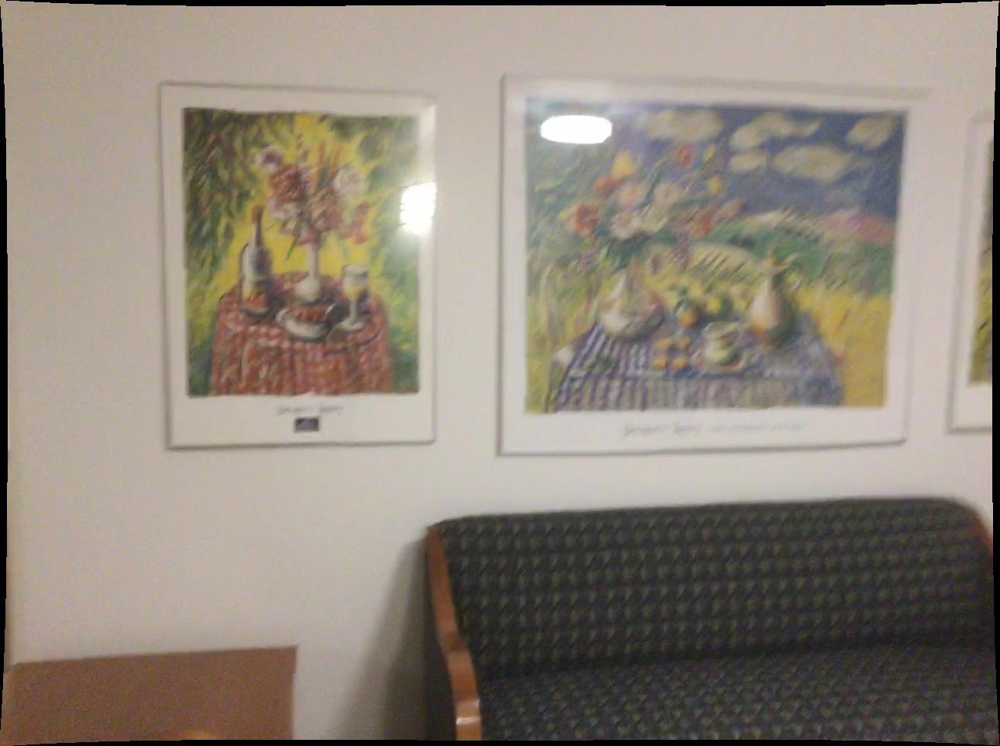
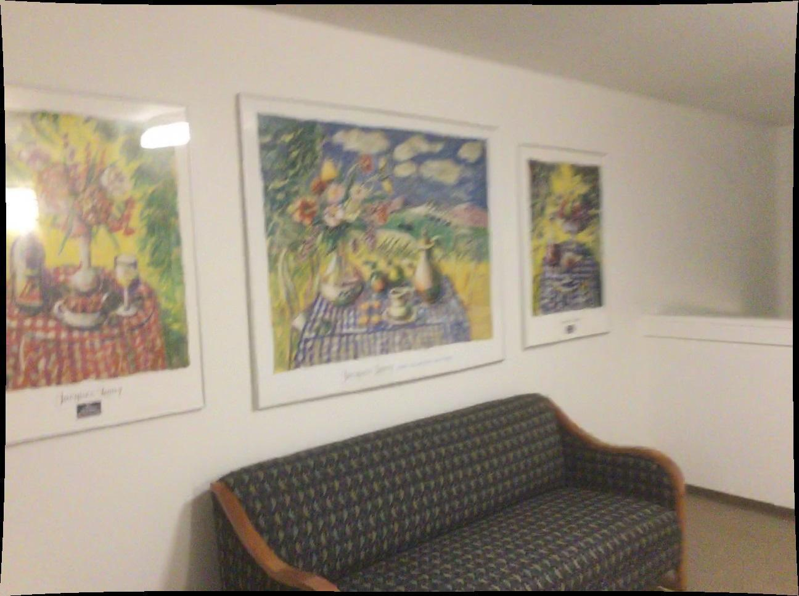
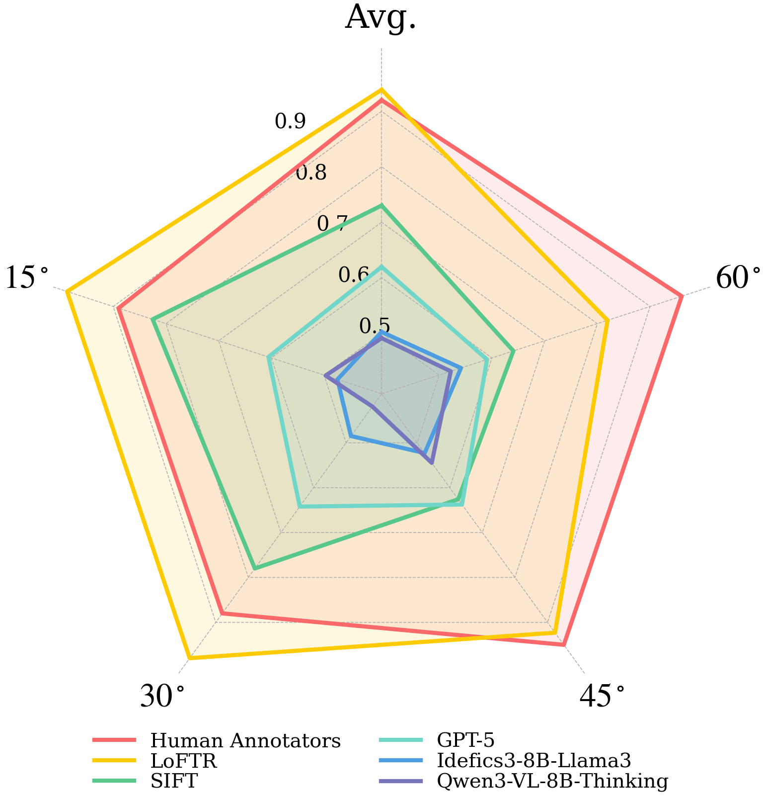
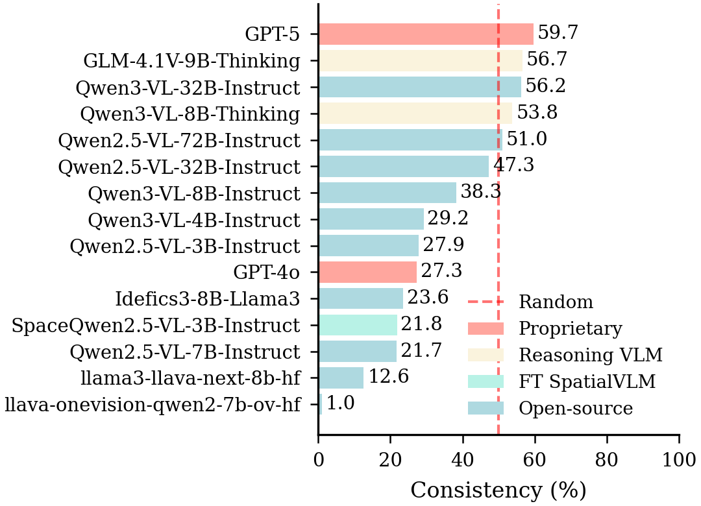
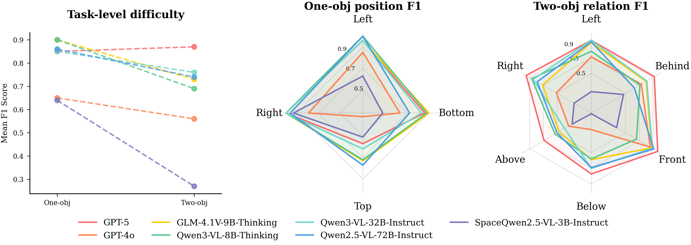
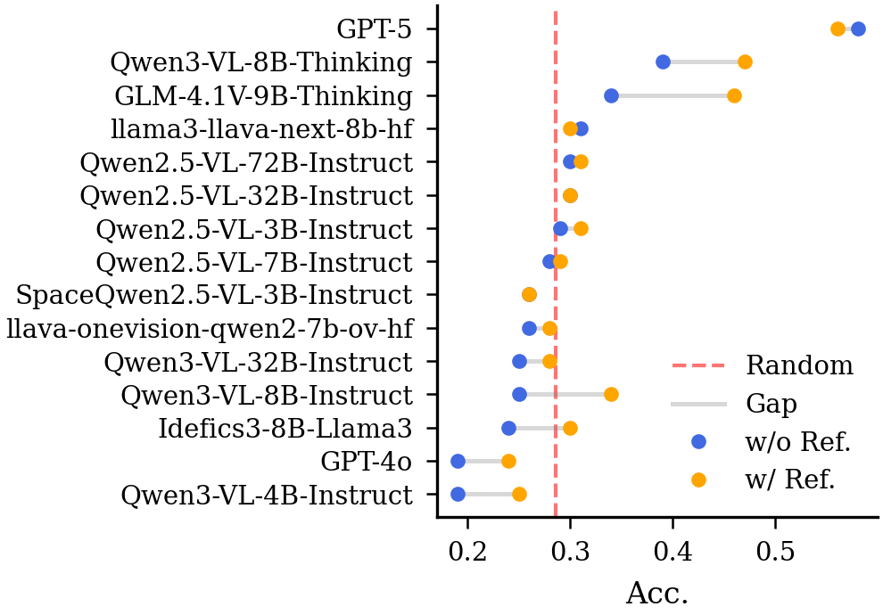
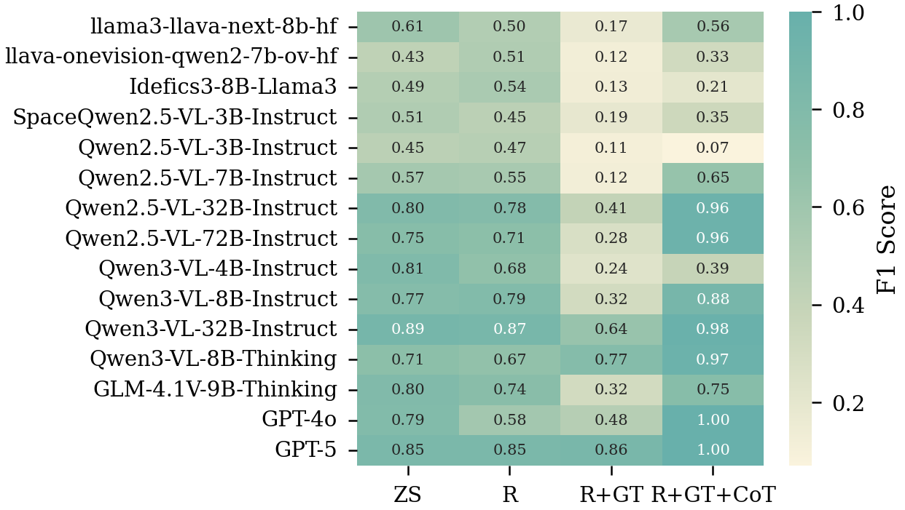

<div align="center" style="font-family: charter;">

<h1><i> Lost in Space?</i></br> Vision-Language Models still Struggle with RCPE</h1>

<a href="https://huggingface.co/datasets/kdeng03/VRRPI-Bench" target="_blank">
    
</a>
<a href="https://huggingface.co/datasets/kdeng03/VRRPI-Diag" target="_blank">
    
</a>

<div>
    Ken Deng, </span>
    Yifu Qiu, </span>
    Yoni Kasten, </span>
    Shay B. Cohen, </span>
    Yftah Ziser
</div>

<!-- <div>
    <sup>1</sup>University of Edinburgh&emsp;
    <sup>2</sup>University of Groningen&emsp;
</div> -->

---

We introduce `VRRPI-Bench`, a benchmark derived from unlabeled egocentric videos with verbalized annotations of relative camera motion, reflecting realistic scenarios with simultaneous translation and rotation around a shared object. We further propose `VRRPI-Diag`, a diagnostic benchmark that isolates individual motion degrees of freedom. Even state-of-the-art models such as GPT-5 ($0.64$) fall short of classic geometric baselines ($0.97$) and human performance ($0.92$). Moreover, VLMs exhibit difficulty in multi-image reasoning, with inconsistent performance (best $59.7\%$) when integrating spatial cues across frames.

Want to compete with VLMs? Try with our [Human Evaluation Google Form](https://forms.gle/3TMuQpETQSz92vHf6).

</div>

## Contents

- [Quick Example](#quick-example)
- [Prepare Benchmark](#prepare-benchmark)
  - [Step1: Download Dataset](#step1-download-dataset)
  - [Step2: Execute Filter Algorithm](#step2-execute-filter-algorithm)
  - [Step3: Generate QA](#step3-generate-qa)
- [Comprehensive Evaluation](#comprehensive-evaluation)
  - [Evaluate VLMs and CV Methods](#evaluate-vlms-and-cv-methods)
  - [Consistency Analysis](#consistency-analysis)
  - [Error Analysis](#error-analysis)
<!-- - [Citation](#citation) -->

## Quick Example

```python
import numpy as np
from datasets import load_dataset

from src.model import load_model, SIFT, LoFTR
from src.dataset.base_eval import qeval, deval, cv_eval

# Load data
data = load_dataset("kdeng03/VRRPI-Bench", split="train")
sample = data[0]

# Prepare images and prompt
images = sample["images"]
K = np.array(sample["intrinsic"])
prompt = sample["qa"]["zero-shot"]["prompt"]
gt_idx = sample["qa"]["zero-shot"]["gt_idx"]
rpv = sample["relative_pose_vector"]

# VLM inference
vlm = load_model("Qwen/Qwen2.5-VL-3B-Instruct")
messages = vlm.format_msg(images, prompt)
ans = vlm.qa(images, messages)

print("-" * 30)
print("Prompt:")
print(prompt)
print("-" * 30)
print("VLM Answer:")
print(ans)
print("-" * 30)
print(f"Ground Truth Index: {gt_idx}")
print("Quick Evaluation:", qeval(gt_idx, ans))
print("-" * 30)
# print("Detailed Evaluation:")
# print(deval(gt_idx, ans))
# print("-" * 30)

# CV methods inference
sift = SIFT()
R_sift, t_sift = sift.pipeline(images, K)

loftr = LoFTR()
R_loftr, t_loftr = loftr.pipeline(images, K)

print("SIFT Evaluation:")
print(cv_eval(rpv, R_sift, t_sift))
print("-" * 30)
print("LoFTR Evaluation:")
print(cv_eval(rpv, R_loftr, t_loftr))
print("-" * 30)
```

<div style="display:flex; gap:16px; text-align:center;">
  
  
</div>

```text
------------------------------
Prompt:
<input>
You are given two consecutive frames from a scene. The first image shows the **source viewpoint**, and the second image shows the **target viewpoint**. The camera moves and rotates simultaneously between these two frames. Use the visual difference between them to reason about the camera motion in 3D space.
</input>

<task>
Select the correct description of the camera motion between these viewpoints.
</task>

<ans-candidates>
0. Move right while yawing left
1. Move left while yawing right
</ans-candidates>

<output-format>
Please stricly follow the format: Provide your spatial reasoning inside <thinking></thinking> XML tags, and provide **only index of your option** inside <ans></ans> XML tags, e.g., <thinking>...</thinking><ans>...</ans>.
Do not output anything else.
</output-format>
------------------------------
VLM Answer:
<thinking>
The source image shows a view with a clear focus on the artwork on the wall, while the target image has a broader view that includes more of the room's interior, such as the couch and the ceiling. This suggests that the camera has moved to the right and also tilted upwards slightly, likely to capture the ceiling.

Therefore, the correct answer is:
<ans>0</ans>
------------------------------
Ground Truth Index: 1
Quick Evaluation: False
------------------------------
SIFT Evaluation:
{'gt_rpv': {'text': ['pitch up', 'yaw right', 'roll clockwise', 'translate left', 'translate up', 'translate forward'], 'value': [2.9669099525323346, 31.30209599581524, 5.87098453833374, -0.860635190409007, -0.11374909424316826, 0.250016928454156]}, 'pred_rpv': {'value': [np.float64(9.160001873458114), np.float64(30.772038103047986), np.float64(9.36535831098582), -0.9590845088891483, 0.12330216278082043, 0.254859728993094], 'text': ['pitch up', 'yaw right', 'roll clockwise', 'translate left', 'translate down', 'translate forward']}, 'is_correct': True, 'is_phi_correct': True, 'is_tx_correct': True}
------------------------------
LoFTR Evaluation:
{'gt_rpv': {'text': ['pitch up', 'yaw right', 'roll clockwise', 'translate left', 'translate up', 'translate forward'], 'value': [2.9669099525323346, 31.30209599581524, 5.87098453833374, -0.860635190409007, -0.11374909424316826, 0.250016928454156]}, 'pred_rpv': {'value': [np.float64(20.42179705844757), np.float64(62.88248741735526), np.float64(32.94701447785277), -0.9571058264962149, -0.09974550759000574, 0.2720280695123386], 'text': ['pitch up', 'yaw right', 'roll clockwise', 'translate left', 'translate up', 'translate forward']}, 'is_correct': True, 'is_phi_correct': True, 'is_tx_correct': True}
------------------------------
```

## Prepare Benchmark

In this section, we introduce how we filter three famous public 3D datasets and generate our benchmarks for spatial reasoning QA. We already published our benchmarks on Hugging Face ([VRRPI-Bench](https://huggingface.co/datasets/kdeng03/VRRPI-Bench) and [VRRPI-Diag](https://huggingface.co/datasets/kdeng03/VRRPI-Diag)), if you are interested in evaluation results, please refer to [Comprehensive Evaluation](#comprehensive-evaluation).

### Step1: Download Dataset

Before everything, confirm that you are under the project directory and prepare the environment:
```bash
cd /path/to/lost-in-space
bash setup.sh # Remember to set the correct CUDA version for your system (default: 12.6)
source .env # Check the env file to configurate .env 
```
> Expected output: a conda environment named `sr` with packages mentioned in `requirements.txt`

Then download the datasets:

1. **[7 Scenes](https://www.microsoft.com/en-us/research/project/rgb-d-dataset-7-scenes/)** is provided for non-commercial use only. By downloading the data, you accept the [license agreement](https://www.microsoft.com/en-us/research/wp-content/uploads/2016/02/7-scenes-msr-la-dataset-7-scenes.rtf). The command for downloading is as follows:

      ```bash
      bash data/rgb-d-dataset-7-scenes/download.sh
      ```
      > Expected output: `data/rgb-d-dataset-7-scenes/*` for raw data from 7 Scenes

2. To use **[ScanNet](http://www.scan-net.org/)**, please fill out an agreement to the [ScanNet Terms of Use](http://kaldir.vc.cit.tum.de/scannet/ScanNet_TOS.pdf), using your institutional email addresses, and send it to <scannet@googlegroups.com>. Then you can recieve the scripts for downloading, please make sure to put `download-scannet.py` under `data/scannet-v2`:
      ```bash
      # Ensure download-scannet.py exists
      git clone https://github.com/ScanNet/ScanNet.git
      bash data/scannet-v2/download.sh # Download data
      bash data/scannet-v2/reader.sh # Parse images
      ```
      > Expected output: `data/scannet-v2/*` for raw data from ScanNet

3. For **[ScanNet++](https://scannetpp.mlsg.cit.tum.de/scannetpp/)**, please [create an account](https://scannetpp.mlsg.cit.tum.de/scannetpp/register), login and create an application. Once your application is approved, you will receive a personalized token to download the data along with further instructions. Please confirm that you put `download_scannetpp.py` under `data/scannetpp`:
      ```bash
      # Ensure download_scannetpp.py exists and set your token in the download_scannetpp.yml
      python data/scannetpp/download_scannetpp.py data/scannetpp/download_scannetpp.yml 
      ```
      > Expected output: `data/scannetpp/*` for raw data from ScanNet++

### Step2: Execute Filter Algorithm

We filter data from 7 Scenes as example as follows (modify configuration in bash file for filtering other datasets and splits):

```bash
bash script/benchmark_filter.sh 
```
> Expected output: `benchmark/bench/ss-15` for filtered data

### Step3: Generate QA

To generate QA prompts and publish them to your Hugging Face Dataset Space, run the following command (make sure your Hugging Face token is configured in `.env`).
```bash
# Print size of dataset 
python bench-gen/bench/gen_qa.py 

# Push to Hugging Face
python bench-gen/bench/gen_qa.py --hf_id YOUR_HF_DATASET_ID
```
> Expected output: the size of dataset and the dataset will be uploaded on your Hugging Face Dataset Space if `--hf_id` is specified

## Comprehensive Evaluation

In this section, we show how to reproduce our results using `Qwen/Qwen2.5-VL-3B-Instruct` as example (you can modify the model list inside each bash file to evaluate other available VLMs).

Supported VLMs (if you want to try with other VLMs, please add new model in `src/model/vlm.py` and register in `src/model/utils.py`):

| VLM ID | Notes |
|----------|-------|
| `llava-hf/llama3-llava-next-8b-hf` | |
| `llava-hf/llava-onevision-qwen2-7b-ov-hf` | |
| `HuggingFaceM4/Idefics3-8B-Llama3` | |
| `remyxai/SpaceQwen2.5-VL-3B-Instruct` | |
| `Qwen/Qwen2.5-VL-3B-Instruct` | Used as example |
| `Qwen/Qwen2.5-VL-7B-Instruct` | |
| `Qwen/Qwen2.5-VL-32B-Instruct` | |
| `Qwen/Qwen2.5-VL-72B-Instruct` | |
| `Qwen/Qwen3-VL-4B-Instruct` | |
| `Qwen/Qwen3-VL-8B-Instruct` | |
| `Qwen/Qwen3-VL-32B-Instruct` | |
| `Qwen/Qwen3-VL-8B-Thinking` | |
| `THUDM/GLM-4.1V-9B-Thinking` | |
| `gpt-4o` | Ensure OpenAI key in `.env` |
| `gpt-5` | Ensure OpenAI key in `.env` |

### Evaluate VLMs and CV Methods

To evaluate VLMs, CV methods on `VRRPI-Bench`, run the following command (modify configuration in `vlm_eval.sh` to evaluate VLMs on `VRRPI-Diag`):
```bash
 bash script/vlm_eval.sh 
 bash script/cv_eval.sh # SIFT, LoFTR
```
> Expected output: `result/bench/zs.jsonl` for VLM results, `result/bench/cv.jsonl` for CV methods results.

Check our visulization of resutls (human, VLMs and CV methods performance on `VRRPI-Bench`):

<div style="text-align:center;">
    
</div>

### Consistency Analysis

In consistency analysis, we swap the order of first image (source viewpoint) and second image (target viewpoint) with the same prompt, and evaluate if VLMs can understand this images input order exchange and change their answer.

To reproduce our results:
```bash
bash script/consistency.sh
```
> Expected output: `result/bench/consistency.jsonl` for VLM consistency evaluation.

Check our visulization of resutls:

<div style="text-align:center;">
    
</div>

### Error Analysis

We provide a three-stages error analysis to investigate the underlying spatial reasoning mechanism of VLMs:

- Stage (i): Intra-Image Spatial Position Understanding - Inspired by [Kamath et al.](https://arxiv.org/abs/2310.19785), we construct one-object tasks (determining an object’s position within the image: left, right, top, bottom) and two-object tasks (determining the relative position between obj.1 and obj.2: left, right, above, below, front, behind)
- Stage (ii): Cross-Image Relational Comparison. - We evaluate whether VLMs can compare how the position of a shared reference object changes under camera motion across two disparate viewpoints. 
- Stage (iii): Camera-Perspective Reasoning. - We evaluate VLMs under four iterative prompting setups.

Run the following command to reproduce our results:
```bash
bash script/ea.sh
```
> Expected output: `result/ea/s1/output.jsonl`, `result/ea/s2/output.jsonl` and `result/ea/s3/output.jsonl` for results in stage (i), stage (ii) and stage (iii), respectively

Check our visulization of resutls (top for stage (i); left bottom for stage (ii); right bottom for stage (iii)):

<div class="img-grid">
  
  
  
</div>

<style>
  .img-grid {
    display: grid;
    grid-template-columns: 1fr 1fr;
    gap: 8px;
    max-width: 100%;
  }

  .img-grid img {
    width: 100%;
    height: auto;
  }

  .img-wide {
    grid-column: 1 / 3;
  }
</style>

<!-- ## Citation
```bibtex
@misc{...,
      title={...}, 
      author={...},
      year={2026},
      eprint={...},
      archivePrefix={arXiv},
      primaryClass={...},
      url={...}, 
}
``` -->
